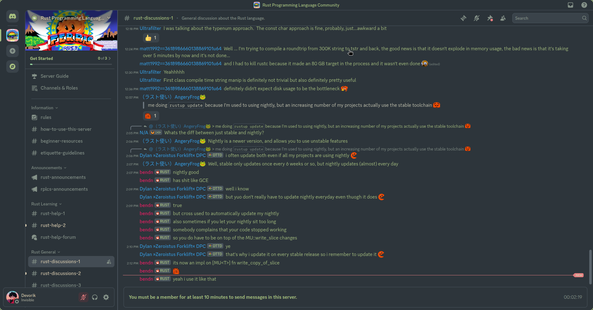

# Everforest Discord Theme

A Discord theme inspired by the Everforest color scheme, designed for a warm, soft, and low-contrast look. Works with [Vencord](https://github.com/Vencord/Vencord) and forks.

## Features

- Calming pastel palette for reduced eye strain
- Supports Everforest Light, Dark, and Hard variants
- Consistent, minimal design
- Easy to customize

## Preview

## Installation (Vencord & Forks)

### 1. Get the Raw CSS Link

- Click on the main theme file in this repo (usually `everforest.theme.css`)
- Click the **"Raw"** button at the top right
- Copy the URL from your browser’s address bar (it should start with `https://raw.githubusercontent.com/themessycraftsman/everforest-discord-theme/...`)

### 2. Add Theme in Discord/Vencord

1. Open Discord.
2. Go to **User Settings > Vencord > Themes**.
3. Click **"Add Theme"** or similar.
4. Paste the raw CSS link into the prompt.
5. Enable the theme.

**For forks with theme URL support:**  
Follow the same process, looking for an "Add custom theme" or similar option.

### 3. Customization

To switch between Everforest variants (Light, Dark, Hard):

- Open the theme file in a text editor.
- Change the relevant import or variable as described in the CSS comments.
- Save and refresh Discord.

## Troubleshooting

- **Theme not showing?**
  - Make sure you pasted the full raw link and enabled the theme.
  - Try restarting Discord.
- **Issues after Discord/Vencord updates?**
  - Disable/re-enable the theme.
  - Report bugs [here](https://github.com/themessycraftsman/everforest-discord-theme/issues).

## Credits

- Theme by [themessycraftsman](https://github.com/themessycraftsman)
- Inspired by [Everforest color scheme](https://github.com/sainnhe/everforest)

---

_Enjoy a cozy Discord experience!_